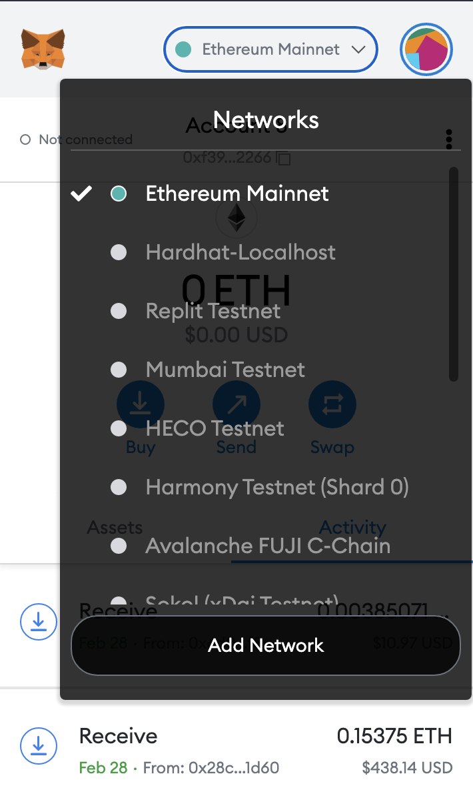

# Decentralized Lottery

<br/>
<p align="center">
<a href="https://chain.link" target="_blank">

</a>
</p>
<br/>


- [Decentralized Lottery](#decentralized-lottery)
- [Clever Programmer Lottery](#clever-programmer-lottery)
- [Getting Started](#getting-started)
  - [Requirements](#requirements)
  - [Quickstart](#quickstart)
- [Useage](#useage)
  - [Deploying Contracts](#deploying-contracts)
  - [Run a Local Network](#run-a-local-network)
  - [Using a Testnet or Live Network (like Mainnet or Polygon)](#using-a-testnet-or-live-network-like-mainnet-or-polygon)
    - [Kovan Ethereum Testnet Setup](#kovan-ethereum-testnet-setup)
  - [Forking](#forking)
- [Test](#test)
  - [Scripts](#scripts)
  - [Verify on Etherscan](#verify-on-etherscan)
- [View Contracts Size](#view-contracts-size)
- [Linting](#linting)
- [Code Formating](#code-formating)
- [Estimaging Gas](#estimaging-gas)
- [Contributing](#contributing)
- [Thank You!](#thank-you)
- [Resources](#resources)

# Clever Programmer Lottery
 Implementation of a completed decentralized lottery, using [Chainlink VRF](https://docs.chain.link/docs/chainlink-vrf) to get a random number and [Chainlink Keepers](https://docs.chain.link/docs/chainlink-keepers/introduction/) to keep the lottery running. 

# Getting Started 

It's recommended that you've gone through the [hardhat getting started documentation](https://hardhat.org/getting-started/) before proceeding here. This repo is based off the [Hardhat Starter Kit](https://github.com/smartcontractkit/hardhat-starter-kit) which may also be a helpful resource. 

## Requirements

- [git](https://git-scm.com/book/en/v2/Getting-Started-Installing-Git)
  - You'll know you did it right if you can run `git --version` and you see a response like `git version x.x.x`
- [Nodejs](https://nodejs.org/en/)
  - You'll know you've installed nodejs right if you can run:
    - `node --version`and get an ouput like: `vx.x.x`
- [Yarn](https://classic.yarnpkg.com/lang/en/docs/install/) instead of `npm`
  - You'll know you've installed yarn right if you can run:
    - `yarn --version` And get an output like: `x.x.x`
    - You might need to install it with npm
- [Metamask](https://metamask.io/)
  - You'll see a little fox icon in the top right corner of the browser you're using. 

## Quickstart

1. Clone and install dependencies

After installing all the requirements, run the following:

```bash
git clone https://github.com/smartcontractkit/clever-lottery-web3
cd clever-lottery-web3
```
Then:
```
yarn
```

or
```
npm i
```

2. Test

```
yarn hardhat test
```

or

```
npx hardhat test
```

3. Run your local node

```
UPDATE_FRONT_END=true hardhat node
```

or

```
UPDATE_FRONT_END=true npx hardhat node
```

You'll get an output like: 
```
Nothing to compile
Local network detected! Deploying mocks...
deploying "VRFCoordinatorV2Mock" (tx: 0xb1811099ad4653047586f3d30dea9d8cae51f74a48277c9ab76ac8ab3ed95b61)...: deployed at 0x5FbDB2315678afecb367f032d93F642f64180aa3 with 1803306 gas
Mocks Deployed!
!!!!!!!!!!!!!!!!!!!!!!!!!!!!!!!!!!!!!!!!!!!!!!!!!!!!
You are deploying to a local network, you'll need a local network running to interact
Please run `yarn hardhat console --network localhost` to interact with the deployed smart contracts!
!!!!!!!!!!!!!!!!!!!!!!!!!!!!!!!!!!!!!!!!!!!!!!!!!!!!
----------------------------------------------------
deploying "Lottery" (tx: 0xc95271276097da9fdfe52ea5ea0e15c7166fbe8be2db49464f2be054d5505e53)...: deployed at 0xCf7Ed3AccA5a467e9e704C703E8D87F634fB0Fc9 with 1595990 gas
Run Price Feed contract with command:
yarn hardhat run scripts/enterLottery.js --network localhost
----------------------------------------------------
Writing to front end...
Front end written!
Started HTTP and WebSocket JSON-RPC server at http://127.0.0.1:8545/

Accounts
========

WARNING: These accounts, and their private keys, are publicly known.
Any funds sent to them on Mainnet or any other live network WILL BE LOST.

Account #0: 0xf39fd6e51aad88f6f4ce6ab8827279cfffb92266 (10000 ETH)
Private Key: 0xac0974bec39a17e36ba4a6b4d238ff944bacb478cbed5efcae784d7bf4f2ff80
.
.
.
.
```

Keep this terminal running, and we'll come back to that `Private Key` later. 


4. Setup your front end

In a second terminal, run: 

```
cd front-end
yarn
yarn run dev
```

or

```
cd front-end
npm i 
npm run dev
```

5. Connect your metamask to your local node

Go to your browser to your metamask. Hit "networks" and "add network". 



Add the following information and hit save:

  - Network Name: hardhat-localhost
  - New RPC URL: http://127.0.0.1:8545/
  - Chain ID: 31337
  - Currency Symbol: ETH
  - Block Explorer URL: (Leave Blank)

Then, switch to that network.


6. Add your local private key

Hit the big circle and select "Import Account"


Add one of the private keys from step 1 where we ran the node. And you should see a balance in your metamask of 10,000 ETH on your hardhat-localhost network. 

7. Go to your front end

Go to http://localhost:3000/

And you should be able to interact with your lottery!

> Note: If you restart your hardhat node, you'll have to "reset" your private key account. In your metamask, just go to "Settings" -> "Advanced" -> "Reset Account". Make sure you only do this on your hardhat-localhost network. 

# Useage

If you run `yarn hardhat --help` you'll get an output of all the tasks you can run. 

## Deploying Contracts

```
yarn hardhat deploy
```

This will deploy your contracts to a local network. Additionally, if on a local network, it will deploy mock Chainlink contracts for you to interact with. If you'd like to interact with your deployed contracts, skip down to [Interacting with Deployed Contracts](#interacting-with-deployed-contracts).

## Run a Local Network

One of the best ways to test and interact with smart contracts is with a local network. To run a local network with all your contracts in it, run the following:

```
yarn hardhat node
```

You'll get a local blockchain, private keys, contracts deployed (from the `deploy` folder scripts), and an endpoint to potentially add to an EVM wallet. 

## Using a Testnet or Live Network (like Mainnet or Polygon) 

> Note: Right now, keepers isn't on rinkeby, so we can only test on BSC or Mainnet. It'll be deployed to rinkeby soon!

In your `hardhat.config.js` you'll see section like:

```
module.exports = {
  defaultNetwork: "hardhat",
  networks: {
```

This section of the file is where you define which networks you want to interact with. You can read more about that whole file in the [hardhat documentation.](https://hardhat.org/config/)

To interact with a live or test network, you'll need:

1. An rpc URL 
2. A Private Key
3. ETH & LINK token (either testnet or real)

Let's look at an example of setting these up using the Kovan testnet. 

### Kovan Ethereum Testnet Setup

First, we will need to set environment variables. We can do so by setting them in our `.env` file (create it if it's not there). You can also read more about [environment variables](https://www.twilio.com/blog/2017/01/how-to-set-environment-variables.html) from the linked twilio blog. You'll find a sample of what this file will look like in `.env.example`

> IMPORTANT: MAKE SURE YOU'D DONT EXPOSE THE KEYS YOU PUT IN THIS `.env` FILE. By that, I mean don't push them to a public repo, and please try to keep them keys you use in development not associated with any real funds. 

1. Set your `KOVAN_RPC_URL` [environment variable.](https://www.twilio.com/blog/2017/01/how-to-set-environment-variables.html)

You can get one for free from [Alchmey](https://www.alchemy.com/), [Infura](https://infura.io/), or [Moralis](https://moralis.io/speedy-nodes/). This is your connection to the blockchain. 

2. Set your `PRIVATE_KEY` environment variable. 

This is your private key from your wallet, ie [MetaMask](https://metamask.io/). This is needed for deploying contracts to public networks. You can optionally set your `MNEMONIC` environment variable instead with some changes to the `hardhat.config.js`.

 **WARNING** 

When developing, it's best practice to use a Metamask that isn't associated with any real money. A good way to do this is to make a new browser profile (on Chrome, Brave, Firefox, etc) and install Metamask on that brower, and never send this wallet money.  

Don't commit and push any changes to .env files that may contain sensitive information, such as a private key! If this information reaches a public GitHub repository, someone can use it to check if you have any Mainnet funds in that wallet address, and steal them!

`.env` example:
```
KOVAN_RPC_URL='www.infura.io/asdfadsfafdadf'
PRIVATE_KEY='abcdef'
```
`bash` example
```
export KOVAN_RPC_URL='www.infura.io/asdfadsfafdadf'
export PRIVATE_KEY='abcdef'
```

> You can also use a `MNEMONIC` instead of a `PRIVATE_KEY` environment variable by uncommenting the section in the `hardhat.config.js`, and commenting out the `PRIVATE_KEY` line. However this is not recommended. 

For other networks like mainnet and polygon, you can use different environment variables for your RPC URL and your private key. See the `hardhat.config.js` to learn more. 

3. Get some Kovan Testnet ETH and LINK 

Head over to the [Chainlink faucets](https://faucets.chain.link/) and get some ETH and LINK. Please follow [the chainlink documentation](https://docs.chain.link/docs/acquire-link/) if unfamiliar. 

4. Running commands

You should now be all setup! You can run any command and just pass the `--network kovan` now!

To deploy contracts:

```
yarn hardhat deploy --network kovan
```

To run staging testnet tests
```
yarn hardhat test --network kovan
```

## Forking 
 
If you'd like to run tests or on a network that is a [forked network](https://hardhat.org/hardhat-network/guides/mainnet-forking.html)
1. Set a `MAINNET_RPC_URL` environment variable that connects to the mainnet.
2. Uncomment the section in your `hardhat.config.js`
```
      // forking: {
      //   url: MAINNET_RPC_URL
      // }
```


# Test
Tests are located in the [test](./test/) directory, and are split between unit tests and staging/testnet tests. Unit tests should only be run on local environments, and staging tests should only run on live environments.

To run unit tests:

```bash
yarn test
```
Or
```
yarn hardhat test
```


## Scripts

For entering a lottery:
```
yarn hardhat run scripts/enter.js
```

For mocking a Chainlink keeper node / Chainlink VRF node:

```
yarn hardhat run scripts/mockOffchain.js
```

## Verify on Etherscan

You'll need an `ETHERSCAN_API_KEY` environment variable. You can get one from the [Etherscan API site.](https://etherscan.io/apis). If you have it set, your deploy script will try to verify them by default, but if you want to verify any manually, you can run: 

```
yarn hardhat verify --network <NETWORK> <CONTRACT_ADDRESS> <CONSTRUCTOR_PARAMETERS>
```
example:

```
yarn hardhat verify --network kovan 0x9279791897f112a41FfDa267ff7DbBC46b96c296 "0x9326BFA02ADD2366b30bacB125260Af641031331"
```

# View Contracts Size

```
yarn run hardhat size-contracts
```

# Linting

This will [lint](https://stackoverflow.com/questions/8503559/what-is-linting) your smart contracts.  

```
yarn lint:fix
```

# Code Formating

This will format both your javascript and solidity to look nicer. 

```
yarn format
```

# Estimaging Gas

To estimate gas, just set a `REPORT_GAS` environment variable to true, and then run:

```
yarn hardhat test
```

If you'd like to see the gas prices in USD or other currency, add a `COINMARKETCAP_API_KEY` from [Coinmarketcap](https://coinmarketcap.com/api/documentation/v1/).


# Contributing

Contributions are always welcome! Open a PR or an issue!

# Thank You!

# Resources

- [Chainlink Documentation](https://docs.chain.link/)
- [Hardhat Documentation](https://hardhat.org/getting-started/)